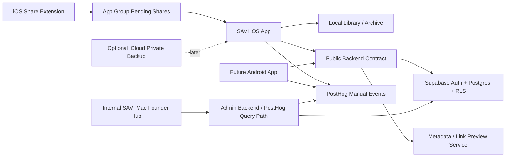

# SAVI Architecture

This folder is the CTO handoff layer for SAVI. It explains what the product is,
how the app is wired, what must remain private, and how the backend should grow
without trapping the company inside one Apple-only implementation.

## North Star

SAVI is a local-first native iOS app that saves scattered links, screenshots,
files, notes, audio, and memories into a searchable personal library. The app
can later add accounts, sync, social discovery, analytics, and Android without
changing the core promise: save it now, find it later.

## Architecture Shape

## Canonical Decisions

- Keep iOS native SwiftUI. Do not rewrite SAVI in React Native.
- Build Android later as a native app against the same backend contract.
- Use Supabase for accounts, social, and public web-link sync.
- Use PostHog for privacy-safe product analytics.
- Keep CloudKit only as optional Apple-private backup/sync later.
- Keep Founder Hub/admin dashboards out of the consumer iPhone app.
- Keep Release/TestFlight social hidden until moderation, deletion, privacy,
  and App Review requirements are complete.

## File Map

- `CTOHandoffIndex.md` - first read for future CTOs, senior engineers, and new chats.
- `MasterRoadmap.md` - living execution map across app, backend, social, desktop, Android, and compliance.
- `SystemContext.md` - product surfaces, trust boundaries, and data flow.
- `ClientArchitecture.md` - iOS, share extension, Mac target, and future Android.
- `BackendArchitecture.md` - Supabase, PostHog, admin backend, and setup.
- `DataModel.md` - portable item/folder/account/public-link models.
- `APIContract.md` - backend contract and endpoint direction.
- `AnalyticsEvents.md` - event rules and metrics the company needs.
- `PrivacyDataInventory.md` - living App Store privacy-label data inventory.
- `PrivacyManifestAudit.md` - privacy manifest and required-reason API audit.
- `ThirdPartySDKInventory.md` - third-party SDK/package dependency inventory.
- `SampleContentReview.md` - sample-library health, media, IP, and fake-document safety review.
- `SecurityAndPrivacy.md` - private data rules, social safety, and secrets.
- `AndroidReadiness.md` - how to keep future Android straightforward.
- `AppStoreComplianceMatrix.md` - Apple/App Store requirement tracker.
- `SocialV1ImplementationPlan.md` - phased social build plan and release gates.
- `SocialMobileUXAndNotifications.md` - mobile social surfaces and notification rules.
- `DesktopAndFounderHubRoadmap.md` - internal Founder Hub vs user-facing Mac companion.
- `MockFlows/MockSocialAndAdminFlows.md` - credential-free mock flows to build before live accounts.
- `Runbooks/SetupChecklist.md` - what the founder must set up.
- `Runbooks/ReleaseGovernance.md` - release, CI, and App Store gates.
- `Runbooks/AppStoreSubmissionPacket.md` - App Store Connect copy, review notes, privacy-label draft, and final human checklist.
- `Runbooks/AppStoreConnectMetadata.md` - copy-paste App Store Connect metadata, TestFlight notes, screenshot plan, and metadata checker.
- `Runbooks/AppStorePrivacyLabels.md` - copy-paste privacy-label posture, conservative support disclosure, and future data-flow triggers.
- `Runbooks/AppStoreAgeRating.md` - age-rating questionnaire posture, health/social/browser caveats, and re-rating triggers.
- `Runbooks/AppStoreExportCompliance.md` - export-compliance plist posture, Apple/system encryption notes, and crypto re-review triggers.
- `Runbooks/TestFlightOperations.md` - internal tester/build assignment flow and old-build troubleshooting.
- `Runbooks/CrashAndPerformanceTriage.md` - tester crash, freeze, slow-scroll, and old-device performance triage.
- `Runbooks/ShareExtensionRealDeviceQA.md` - real-device Share Sheet save matrix, metadata fallback, and app-group import QA.
- `Runbooks/ArchiveExportRestoreQA.md` - full archive export, compact backup, fresh-install restore, and private-content QA.
- `Runbooks/StatusReports.md` - how to generate a current cross-chat repo/build status snapshot.
- `ADRs/` - architecture decision records.

## Current Repo Truth

- Active repo: `/Users/guest1/Documents/SAVI-iOS`.
- Main iPhone app target: `SAVI`.
- Share extension target: `SAVIShareExtension`.
- Internal Mac target: `SAVI Mac`.
- Release/TestFlight bundle: `com.altatecrd.savi`.
- Debug/internal bundle: `com.altatecrd.savi.personaldebug`.

Before changing architecture, read:

- `/Users/guest1/Documents/SAVI-iOS/AGENTS.md`
- `/Users/guest1/Documents/SAVI-iOS/Docs/Handoffs/SAVI_ACTIVE_WORK_LOG.md`
- `/Users/guest1/Documents/SAVI-iOS/Docs/Architecture/CTOHandoffIndex.md`
- `/Users/guest1/Documents/SAVI-iOS/Docs/Architecture/MasterRoadmap.md`
- `/Users/guest1/Documents/SAVI-iOS/Docs/Architecture/PrivacyDataInventory.md`
- `/Users/guest1/Documents/SAVI-iOS/Docs/Architecture/Runbooks/AppStorePrivacyLabels.md`
- `/Users/guest1/Documents/SAVI-iOS/Docs/Architecture/Runbooks/AppStoreAgeRating.md`
- `/Users/guest1/Documents/SAVI-iOS/Docs/Architecture/Runbooks/AppStoreExportCompliance.md`
- `/Users/guest1/Documents/SAVI-iOS/Docs/Architecture/PrivacyManifestAudit.md`
- `/Users/guest1/Documents/SAVI-iOS/Docs/Architecture/ThirdPartySDKInventory.md`
- `/Users/guest1/Documents/SAVI-iOS/Docs/Architecture/SampleContentReview.md`
- `/Users/guest1/Documents/SAVI-iOS/Docs/Backend/README.md`
- `/Users/guest1/Documents/SAVI-iOS/Docs/Backend/AccountDeletionRunbook.md`
- `/Users/guest1/Documents/SAVI-iOS/Docs/Backend/AdminModerationWorkflow.md`
- `/Users/guest1/Documents/SAVI-iOS/Docs/Backend/NotificationRunbook.md`
